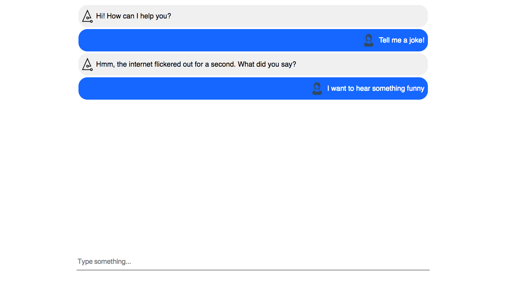

# Jokebot

## Try it now! [JokeBot](https://jokebot-spruce.herokuapp.com/)

-----------------------------
## Technologies Used

### Front-end: 
* Watson Conversation API
* React components
* Flexbox

### Routing and back-end:
* Express.js 
* Node.js
* [Excuses API](https://excuses-api.herokuapp.com/)
* Sequelize
* PostgreSQL

-----------------------------
## The General Approach

* Wanted to use the Spruce technology stack, so I started by following a [Next tutorial](https://learnnextjs.com/), then realized how little documentation there is for it
* Changed gears and followed a tutorial on how to create a movie recommender with React and Watson ([see link here](https://developer.ibm.com/recipes/tutorials/how-to-create-a-chatbot-of-movie-recommendations-with-reactjs-and-connect-it-to-facebook-messenger/)), but it had lots of bugs, was half-written in Spanish, and was missing some files (e.g. webpack and css) 
* Tried to think of something funny beyond the recommended APIs and did some research but didn't really find anything I liked. Finally settled on deploying my own custom API which borrows heavily from the [Developer Excuses API](http://developerexcuses.com/)
* Wanted the design to be simple, sleek and unintrusive. In the original tutorial, they used classes and ids to style everything, but the documentation I read said that React components worked better with inline styling. Also accidentally used flexbox for the first time when following along with some of the recommended style guides

-----------------------------
## User Stories

* [Trello](https://trello.com/b/LJw06k0d/react-chatbot)

-----------------------------
## Todo List

- [ ] Add moar better jokes to the API
- [ ] Add "..." animation when waiting for a joke to come back from the API
- [ ] Find a way to handle negatives in the request to the chatbot, i.e. "Don't tell me a joke"
- [ ] Convert to Next.js
- [ ] Add Redux into the mix
- [ ] Add web speech API so that you can also talk to the Jokebot